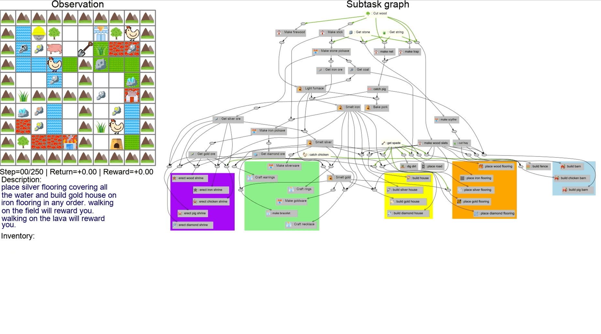

## Abstract

> Humans have the capability, aided by the expressive, compositional nature of language, to learn quickly by
demonstration. Given very few examples, they can generalize known concepts in order to infer novel goals then accomplish them in novel settings. Here we introduce DescribeWorld, a task environment designed to test this sort of generalization skill in grounded autonomous agents. We task agents first with inferring an unseen goal from a single demonstration in a 2D Minecraft-style grid world, then with accomplishing the goal in a new setting without access to ground truth task descriptions. Goals are linguistically and procedurally composed of learnt concepts.

> Inspired by how humans leverage language as a powerful tool for generalization, we propose a neural agent infused with hierarchical latent language--both at the level of goal inference and subgoal planning-- that learns to perform grounded, one-shot demonstration following. We find that agents that thus reparametrize the task into a policy search through text space are better equipped to perform the challenge, particularly when faced with tests of systematic generalization.

## DescribeWorld: A Demonstration/Description-Following Environment for Tasks with Complex Subdependencies

This work tests whether artificial agents can learn new complex tasks just from a single demonstration.
This task is difficult for an agent because we _prevent it from accessing a text description of the task_, so it must learn what the goal is from demonstration state transitions alone. 
It must figure out from the demonstration which sequence of subtasks will accomplish the goal. Subtasks involve interacting with various domain objects to acquire tools and ingredients, craft items, build structures and place terrains.

For example, we
show a bot a demonstration of agent completing the task `build a house then go to the lumbershop`, then test whether the
bot can accomplish the same task in a new gridworld environment:

<table>
<tr> 
<td><figure>  </figure></td>

<td>
<!-- img src="assets/dbot.png" width="40%" -->
<figure>  </figure></td>
</tr>
</table>

In order to test this, we construct a gridworld environment containing many subtasks with interrelated task dependencies.
That way, an agent can learn to reuse subtasks in order to accomplish unseen tasks within realistic expectations.

 <figure>  </figure> 

<table>
<tr>
<td colspan="3">
We create multiple types of task end goals for the agent to accomplish. We pair each task with an oracle that derives the sequence of subtasks needed to be completed. 
</td>
</tr>
  <tr>
    <td>Navigating to Landmarks</td>
    <td>Crafting Items</td>
<td>Building Structures</td>
  </tr>
<tr>
<td><figure>  </figure></td>
<td><figure>  </figure></td>
<td><figure>  </figure></td>
</tr>
  <tr>  <td>Placing Terrains</td>
<td>Covering Terrains</td>
<td>Clearing Items</td>
</tr>
<tr>
<td><figure>  </figure></td>
<td><figure>  </figure></td>
<td><figure>  </figure></td>
</tr>
<tr>
<td colspan="3">
We also add environmental constraints, like penalties for walking on a terrain or rewards for walking on another.
This, in addition to various compositions of end goals, gives us thousands of unique end goals for our agent to learn.
</td>
</tr>
<tr>
<td><figure>  </figure></td>
<td><figure>  </figure></td>
<td><figure>  </figure></td>
</tr>
</table>

# Testing for Language-Aided Systematic Generalization
If a child were to learn how to `build an iron shrine` and `place wood flooring`, they could work out how to `place iron flooring` by recombining various ingredients. We test for this sort of ability in our agents by constructing **[systematic generalization splits](https://cims.nyu.edu/~brenden/papers/RuisEtAl2020NeurIPS.pdf)** that require procedural recombination of learned concepts in order to solve hidden tasks.

# Hierarchical Latent Language Policy Agent
We devise a neural agent that leverages language at multiple levels of abstraction in order to learn complex tasks from demonstration.
This agent is made up of a **describer**, which generates a text description of a demonstrated task, an **instructor**, which generates intermediate-level planning instructions, and an **executor**, which completes instructions by executing low-level actions.

