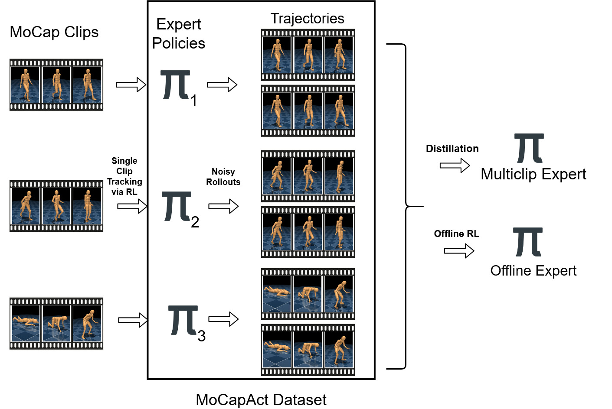
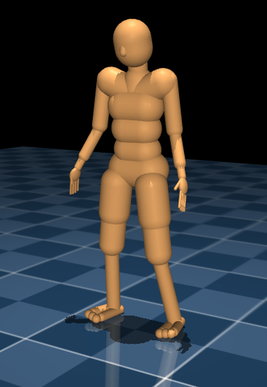

## Abstract

> We can include an abstract here... if we want?

## MoCapAct: Dataset

The MoCapAct Dataset consists of expert policies that are trained to track individual clips as well as noisy rollouts from each expert. These rollouts can subsequently be used to train a multi-clip expert via distillation.

## Download Instructions

Add bash scripts or other instructions to download the dataset.

## Distilled Experts

Videos of experts trained using this dataset.

<table>
<tr> 
<td><figure>  </figure></td>

<td>
<figure>  </figure></td>
</tr>
</table>

# Authors

These are our authors