

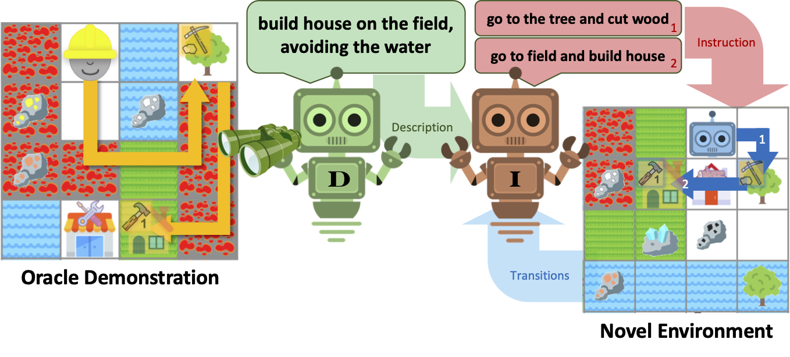

## Abstract

> This abstract is very abstract

## MoCapAct: Dataset

The MoCapAct Dataset consists of expert policies that are trained to track individual clips as well as noisy rollouts from each expert. These rollouts can subsequently be used to train a multi-clip expert via distillation.

<table>
<tr> 
<td><figure> 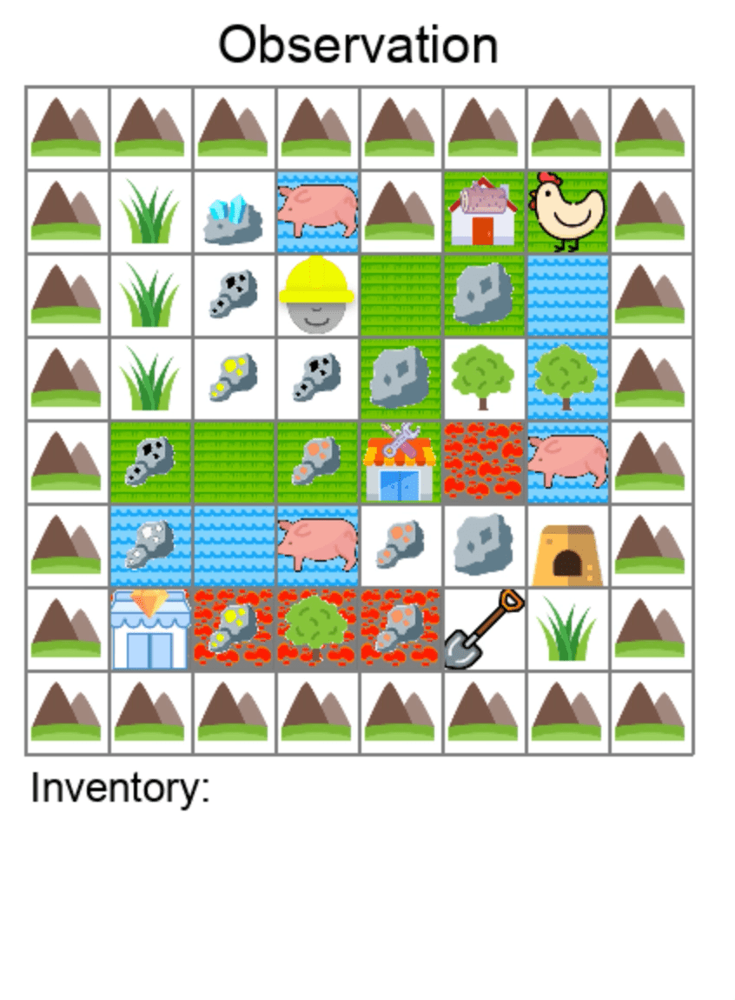 </figure></td>

<td>
<figure> 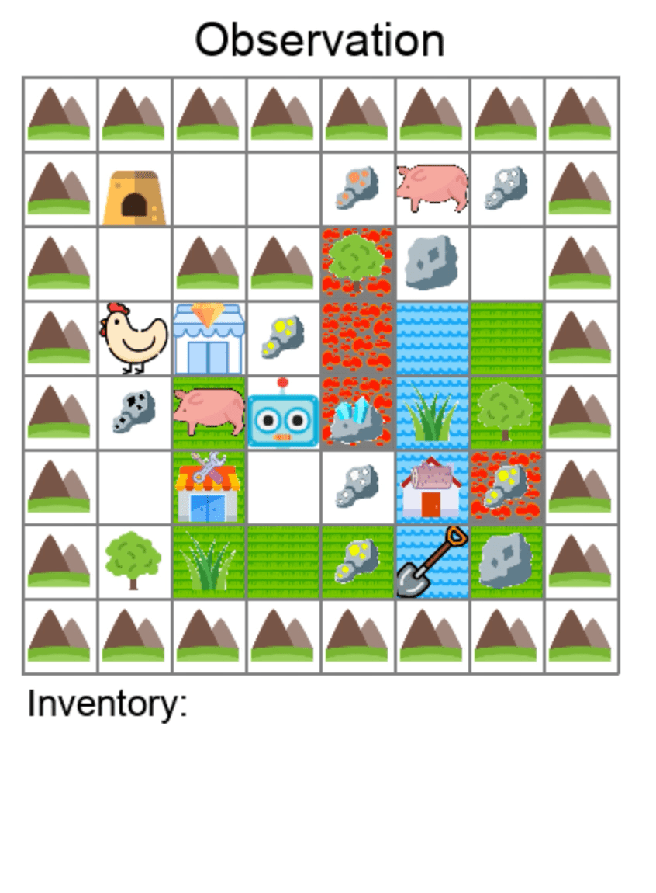 </figure></td>
</tr>
</table>

In order to test this, we construct a gridworld environment containing many subtasks with interrelated task dependencies.
That way, an agent can learn to reuse subtasks in order to accomplish unseen tasks within realistic expectations.

 <figure> 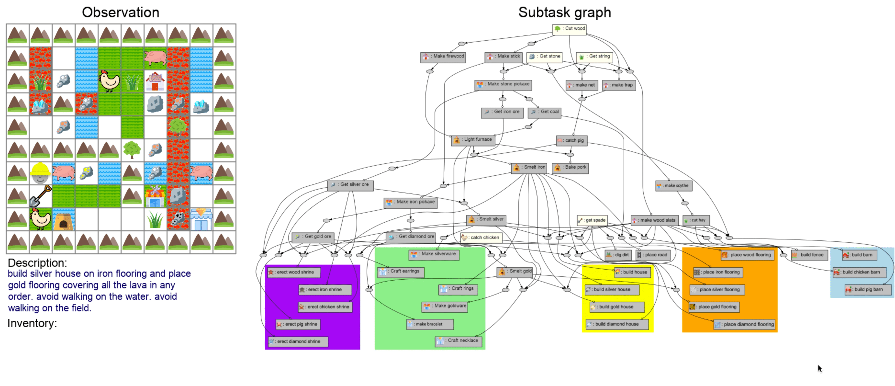 </figure> 

<table>
<tr>
<td colspan="2">
We create multiple types of task end goals for the agent to accomplish. We pair each task with an oracle that derives the sequence of subtasks needed to be completed. 
</td>
</tr>
  <tr>
    <td>Navigating to Landmarks</td>
    <td>Crafting Items</td>
  </tr>
<tr>
<td><figure>  </figure></td>
<td><figure> 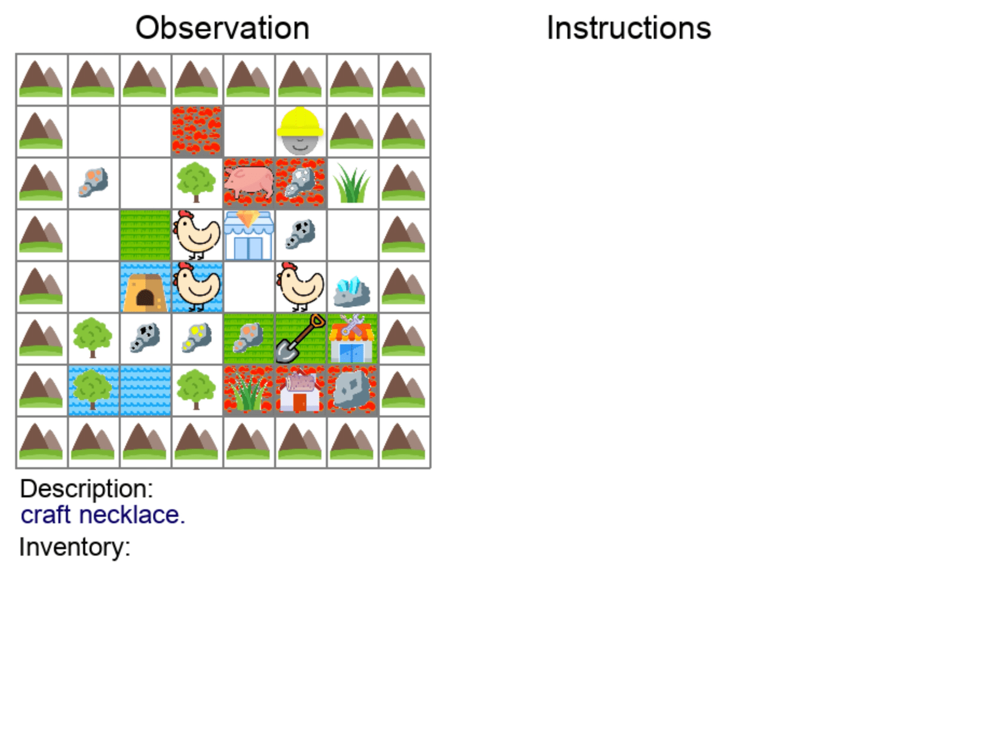 </figure></td>
</tr>
  <tr>
<td>Building Structures</td>
 <td>Placing Terrains</td>
  </tr>
<tr>
<td><figure>  </figure></td>
<td><figure> 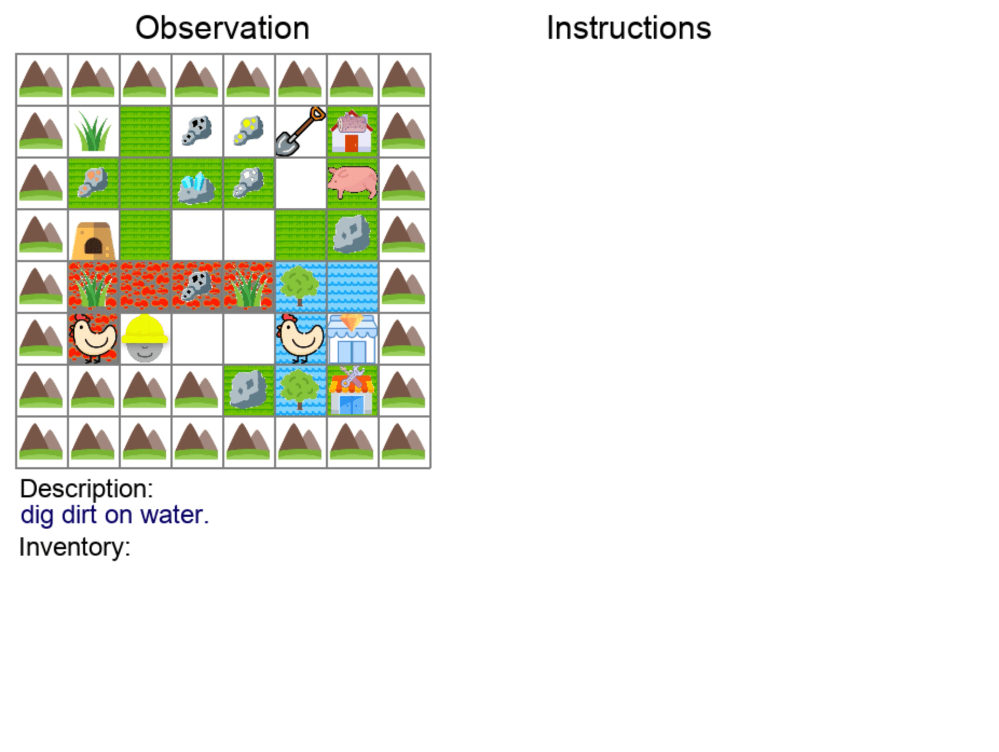 </figure></td>
</tr>
<tr>
<td>Covering Terrains</td>
<td>Clearing Items</td>
</tr>
<tr>
<td><figure> 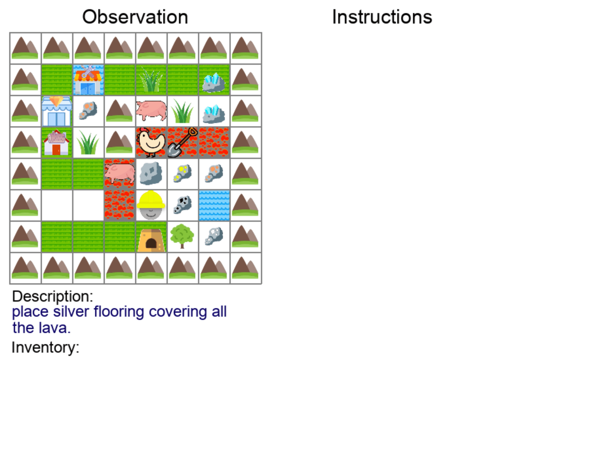 </figure></td>
<td><figure> 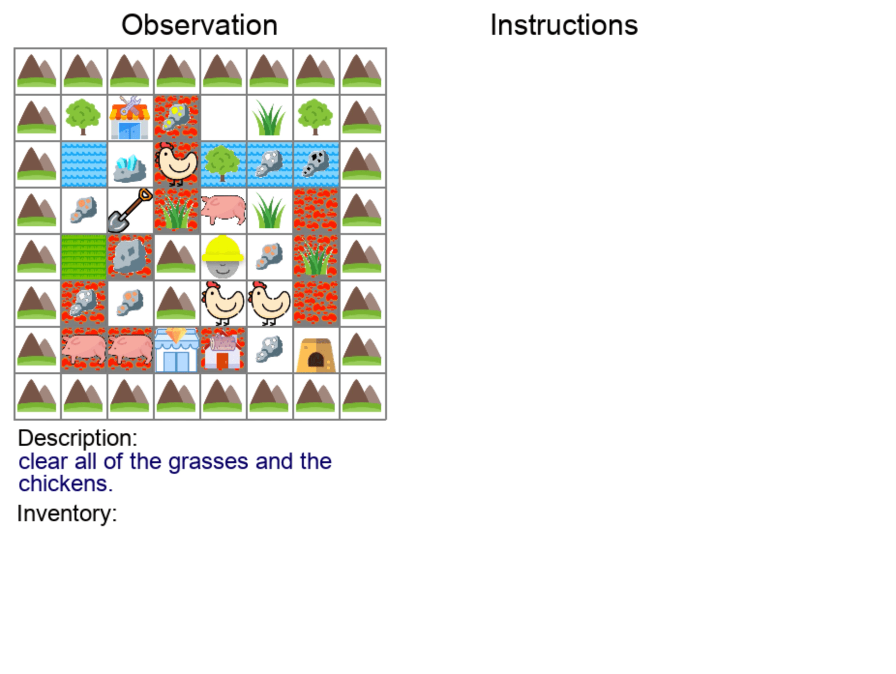 </figure></td>
</tr>
<tr>
<td colspan="2">
We also add environmental constraints, like penalties for walking on a terrain or rewards for walking on another.
This, in addition to various compositions of end goals, gives us thousands of unique end goals for our agent to learn.
</td>
</tr>
<tr>
<!-- td><figure> 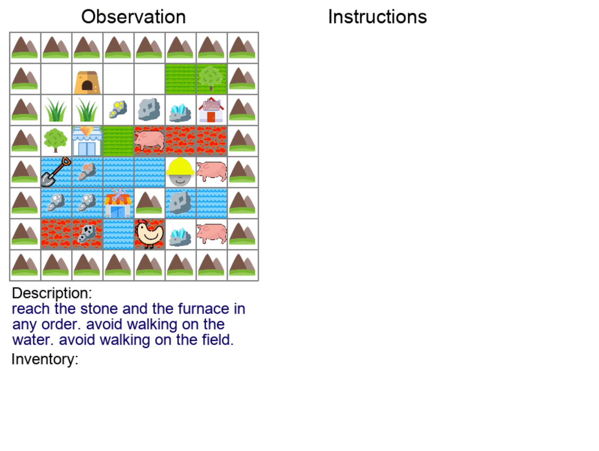 </figure></td -->
<td><figure> 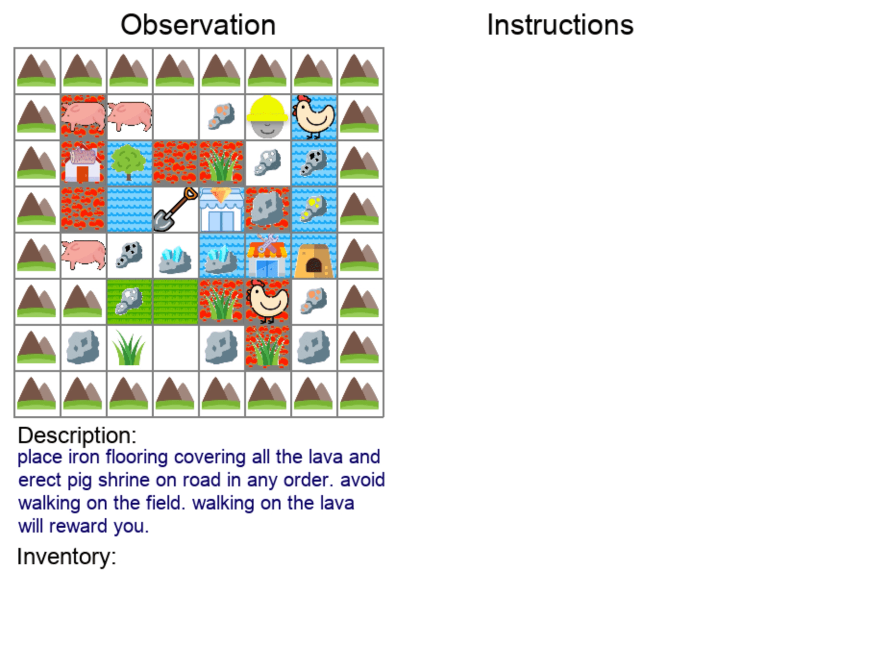 </figure></td>
<td><figure> 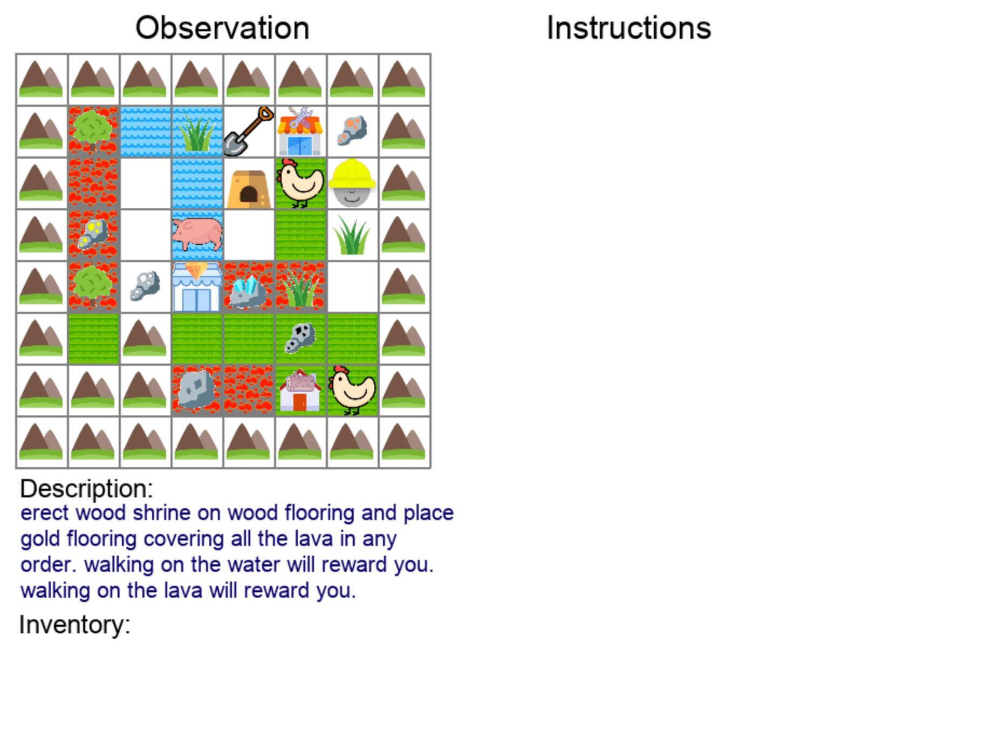 </figure></td>
</tr>
</table>

# Testing for Language-Aided Systematic Generalization
If a child were to learn how to `build an iron shrine` and `place wood flooring`, they could work out how to `place iron flooring` by recombining various ingredients. We test for this sort of ability in our agents by constructing **[systematic generalization splits](https://cims.nyu.edu/~brenden/papers/RuisEtAl2020NeurIPS.pdf)** that require procedural recombination of learned concepts in order to solve hidden tasks.

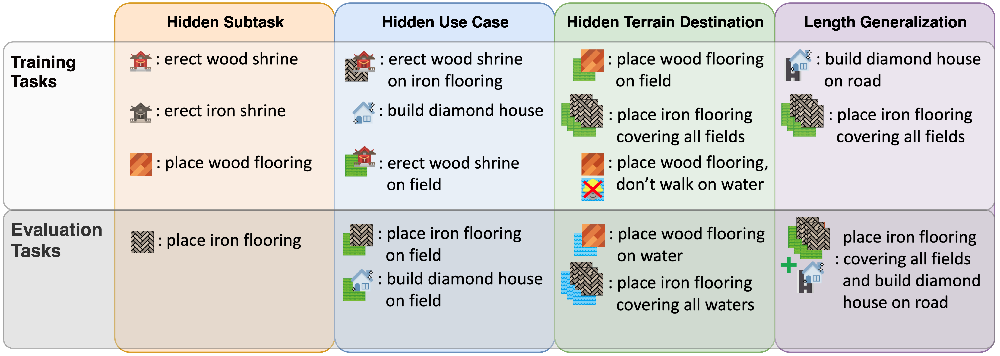

# Hierarchical Latent Language Policy Agent
We devise a neural agent that leverages language at multiple levels of abstraction in order to learn complex tasks from demonstration.
This agent is made up of a **describer**, which generates a text description of a demonstrated task, an **instructor**, which generates intermediate-level planning instructions, and an **executor**, which completes instructions by executing low-level actions.

# Findings
* Representing policy decisions through latent language representation improves performance on one-shot demonstration following of novel tasks. It also improves the interpretability of the decision-making process and isolates the levels of abstraction at which generalization needs to occur, since our executor module performs very effectively in many settings without access to high-level task information.
* However, latent language is not a compositional generalization "silver bullet"; models still fail to perform the held-out tasks in our systematic generalization splits.

