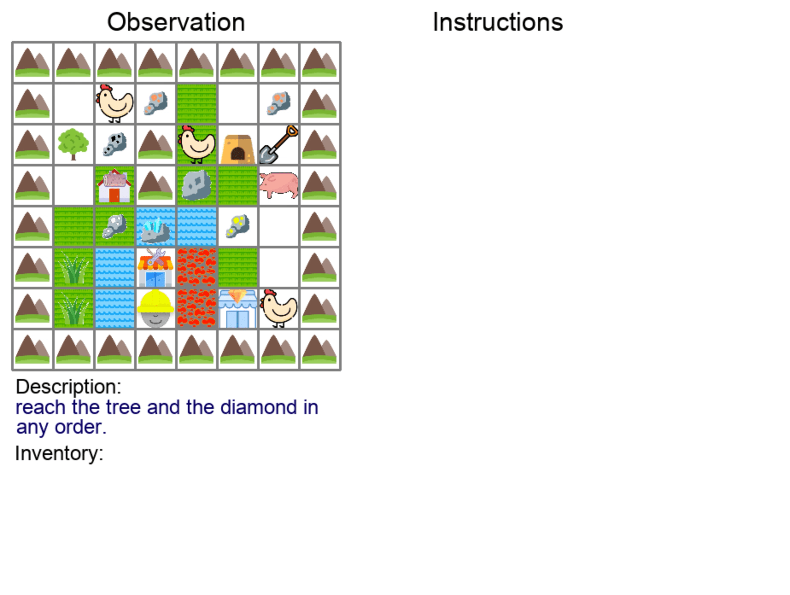
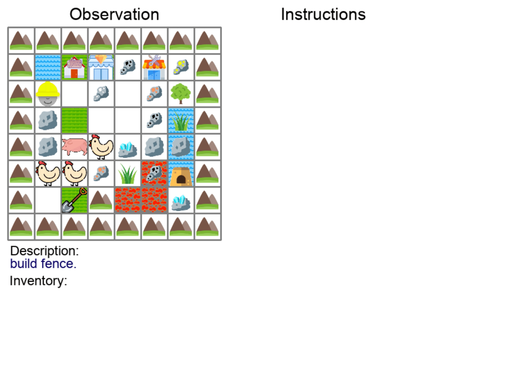

  

## DescribeWorld

Humans have the capability, aided by the expressive, compositional nature of language, to learn quickly by
demonstration. Given very few examples, they can generalize known concepts in order to infer novel goals then accomplish
them in novel settings. Here we introduce DescribeWorld, a task environment designed to test this sort of generalization
skill in grounded autonomous agents. We task agents first with inferring an unseen goal from a single demonstration in a
2D Minecraft-style grid world, then with accomplishing the goal in a new setting without access to ground truth task
descriptions. Goals are linguistically and procedurally composed of learnt concepts.

Inspired by how humans leverage language as a powerful tool for generalization, we propose a neural agent infused with
hierarchical latent language--both at the level of goal inference and subgoal planning-- that learns to perform
grounded, one-shot demonstration following. We find that agents that thus reparametrize the task into a policy search
through text space are better equipped to perform the challenge, particularly when faced with tests of systematic
generalization.

## DescribeWorld: A Demonstration/Description-Following Environment for Tasks with Complex Subdependencies

This work tests whether artificial agents can learn new complex tasks just from a single demonstration. For example, we
show a bot a demonstration of agent completing the task `build a house then go to the lumbershop`, then test whether the
bot can accomplish the same task in a new gridworld environment.

<table>
<tr> 
<td></td>
<td></td>
</tr>
</table>

In order to test this, we construct a gridworld environment containing many subtasks with interrelated task
dependencies.

  

That way, we can create an inventory of many high-level tasks whose subdependencies overlap with each other.

### Task Categories

<table>
  <tr>
    <td>Navigation to Locations</td>
    <td>Crafting Items</td>
  </tr>
<tr>
<td></td>
<td></td>
</tr>
  <tr> <td>Building Structures</td> <td>Placing Terrains</td></tr>
<tr>
<td>Covering Terrains</td>
<td>Clearing Items</td>
</tr>
</table>

<!--  -->

<!--  -->

## Hierarchical Latent Language Policy Agent

<!--  -->

## Testing for Language-Aided Systematic Generalization

<!--  -->
