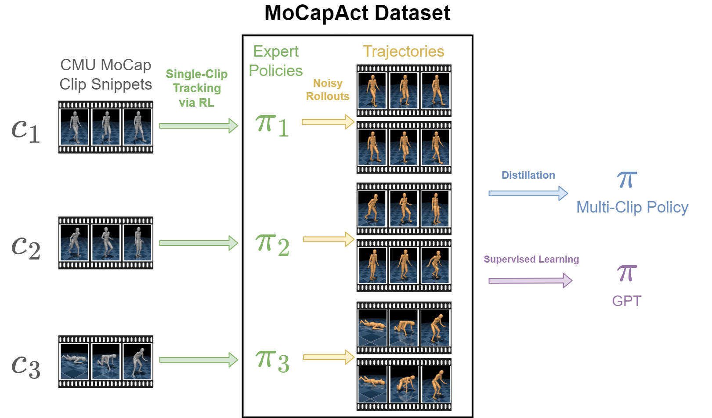

<style>thead { display: none; }</style>

<p align="center">
  
</p>

## Abstract

Control of simulated humanoid characters is a challenging benchmark for sequential decision-making methods, as it assesses a policy's ability to drive an inherently unstable, discontinuous, and high-dimensional physical system.
One widely studied approach is to utilize motion capture (MoCap) data to teach the humanoid agent low-level skills (e.g., standing, walking, and running) that can be used to generate high-level behaviors.
However, even with MoCap data, controlling simulated humanoids remains very hard, as MoCap data offers only kinematic information.
Finding physical control inputs to realize the demonstrated motions requires computationally intensive methods like reinforcement learning.
Thus, despite the publicly available MoCap data, its utility has been limited to institutions with large-scale compute.
In this work, we dramatically lower the barrier for productive research on this topic by training and releasing high-quality agents that can track over three hours of MoCap data for a simulated humanoid in the <tt>dm_control</tt> physics-based environment.
We release <b>MoCapAct</b> (Motion Capture with Actions), a dataset of these expert agents and their rollouts containing proprioceptive observations and actions.
We demonstrate the utility of MoCapAct by using it to train a <em>single</em> hierarchical policy capable of tracking the <em>entire</em> MoCap dataset within <tt>dm_control</tt> and show the learned low-level component can be re-used to efficiently learn high-level other tasks.
Finally, we use MoCapAct to train an autoregressive GPT model and show that it can perform natural motion completion given a motion prompt.

## MoCapAct Dataset
The MoCapAct dataset consists of:
- expert policies that are trained to track individual clips and
- HDF5 files of noisy rollouts collected from each expert.

We include zipped rollout datasets of two sizes: a "small" 46 GB dataset with 20 rollouts per snippet and a "large" 559 GB dataset with 200 rollouts per snippet.
The HDF5 files can be used to train a multi-clip policy or GPT policy.
Please refer to Appendix B of our paper for the structure of the experts and HDF5 files.

## Download Instructions
We provide links to download the three components of the dataset in the form of GZ files.
We also provide a Python script to download a user-provided subset of the dataset.
Specify a type `-t` from `<experts | small_dataset | larget_dataset>`, a comma-separated list of clips `-c` (e.g., `CMU_001_01,CMU_002_01`) or a specific subset from <tt>dm_control</tt>'s [MoCap subsets](https://github.com/deepmind/dm_control/blob/main/dm_control/locomotion/tasks/reference_pose/cmu_subsets.py) of form `<get_up | walk_tiny | run_jump_tiny | locomotion_small | all>`, and a destination path `-d`.
For example:
```bash
python -m mocapact.download_dataset -t small_dataset -c CMU_001_01,CMU_002_01 -d ./data
python -m mocapact.download_dataset -t experts -c CMU_083_33 -d ./data
```

The expert can then be loaded using our package:
```python
from mocapact import observables
from mocapact.sb3 import utils
expert_path = "data/experts/CMU_083_33-0-194/eval_rsi/model"
expert = utils.load_policy(expert_path, observables.TIME_INDEX_OBSERVABLES)

from mocapact.envs import tracking
from dm_control.locomotion.tasks.reference_pose import types
dataset = types.ClipCollection(ids=['CMU_083_33'], start_steps=[0], end_steps=[194])
env = tracking.MocapTrackingGymEnv(dataset)
obs, done = env.reset(), False
while not done:
    action = expert.predict(obs, deterministic=True)
    obs, rew, done, _ = env.step(action)
    print(rew)
```
The HDF5 rollouts files can be read and utilized in Python:
```python
import h5py
dset = h5py.File("data/small_dataset/CMU_002_01.hdf5", "r")
print("Expert actions from first rollout episode:")
print(dset["CMU_002_01-0-92/0/actions"][...])
```

**<span style="color:red">Note:</span>** All experts and rollouts are only compatible with MuJoCo 2.1.5 or earlier due to MuJoCo 2.2.0 changing how actuator forces are calculated.

## Clip Snippet Experts
We train an expert policy for each of the 2589 snippets within the MoCap dataset.
We find that the experts faithfully reproduce the overwhelming majorty of clips.
On clips where the expert deviates from the clip (e.g., bottom right), the expert learns some other behavior to keep the episode from terminating early.

<table>
<tr>
  <td><video width="320" height="240" src="assets/clip_expert/deterministic/CMU_016_22-0-82.mp4" type="video/mp4" controls></video></td>
  <td><video width="320" height="240" src="assets/clip_expert/deterministic/CMU_038_03-0-208.mp4" type="video/mp4" controls></video></td>
  <td><video width="320" height="240" src="assets/clip_expert/deterministic/CMU_015_04-1036-1217.mp4" type="video/mp4" controls></video></td>
</tr>
<tr>
  <td><video width="320" height="240" src="assets/clip_expert/deterministic/CMU_049_07-0-127.mp4" type="video/mp4" controls></video></td>
  <td><video width="320" height="240" src="assets/clip_expert/deterministic/CMU_061_01-172-377.mp4" type="video/mp4" controls></video></td>
  <td><video width="320" height="240" src="assets/clip_expert/deterministic/CMU_075_09-0-203.mp4" type="video/mp4" controls></video></td>
</tr>
</table>

## Noisy Rollouts
We generate the dataset by repeatedly rolling out the experts with some injected action noise and recording the observations, actions, rewards, etc.
Below are videos showing noisy rollouts for the same clips from the previous section.
<table>
<tr>
  <td><video width="320" height="240" src="assets/clip_expert/noisy/CMU_016_22-0-82.mp4" type="video/mp4" controls></video></td>
  <td><video width="320" height="240" src="assets/clip_expert/noisy/CMU_038_03-0-208.mp4" type="video/mp4" controls></video></td>
  <td><video width="320" height="240" src="assets/clip_expert/noisy/CMU_015_04-1036-1217.mp4" type="video/mp4" controls></video></td>
</tr>
<tr>
  <td><video width="320" height="240" src="assets/clip_expert/noisy/CMU_049_07-0-127.mp4" type="video/mp4" controls></video></td>
  <td><video width="320" height="240" src="assets/clip_expert/noisy/CMU_061_01-172-377.mp4" type="video/mp4" controls></video></td>
  <td><video width="320" height="240" src="assets/clip_expert/noisy/CMU_075_09-0-203.mp4" type="video/mp4" controls></video></td>
</tr>
</table>

## Multi-Clip Policy
We then train a multi-clip policy on the dataset to track all the clips in <tt>dm_control</tt>.
On some clips, we find the mutli-clip policy can faithfully track the MoCap clip (including very long segments):
<table>
<tr>
  <td><video width="320" height="240" src="assets/multiclip/CMU_016_22.mp4" type="video/mp4" controls></video></td>
  <td><video width="320" height="240" src="assets/multiclip/CMU_069_56.mp4" type="video/mp4" controls></video></td>
  <td><video width="320" height="240" src="assets/multiclip/CMU_015_04.mp4" type="video/mp4" controls></video></td>
</tr>
</table>

On other clips, the policy can only track the clip for a short time before making a mistake that causes the humanoid to lose balance and fall over:

<table>
<tr>
  <td><video width="320" height="240" src="assets/multiclip/CMU_038_03.mp4" type="video/mp4" controls></video></td>
  <td><video width="320" height="240" src="assets/multiclip/CMU_049_07.mp4" type="video/mp4" controls></video></td>
  <td><video width="320" height="240" src="assets/multiclip/CMU_061_01-172.mp4" type="video/mp4" controls></video></td>
  <td><video width="320" height="240" src="assets/multiclip/CMU_075_09.mp4" type="video/mp4" controls></video></td>
</tr>
</table>

## Task Transfer
We can re-use the low-level component of the mutli-clip policy to aid in learning new humanoid tasks.

## Motion Completion
